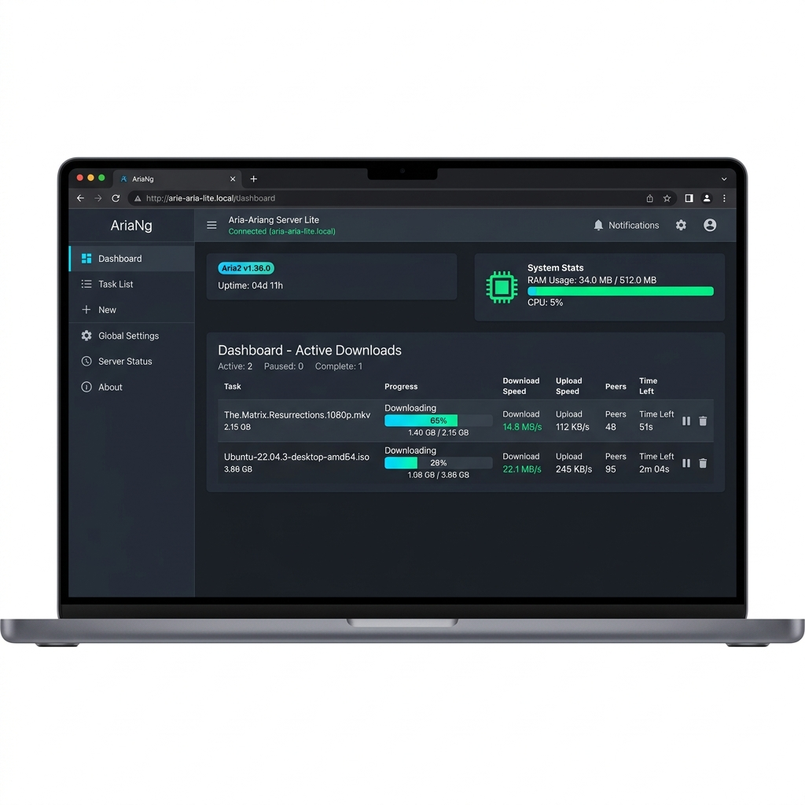

# Aria-Ariang Server (Lite Version) ⚡

> **Lite Edition**: Ultra-lightweight, high-performance download & cloud sync server powered by Docker, Aria2, AriaNg, and Nginx.

[](https://docs.docker.com/compose/)
[](#performance--resource-footprint)
[](LICENSE)

<p align="center">
  
</p>


---

## 💡 Why Lite?

Standard seedbox/download stacks often bundle heavy web dashboards, resource-intensive file managers, and monitoring containers that consume **350MB – 500MB+ RAM** at idle.

**Aria-Ariang Lite** strips away all unnecessary abstractions (YAGNI principle):
* ❌ **No Heavy FileBrowser Container**: Replaced with Nginx's native, zero-RAM HTTP `autoindex` engine for directory browsing and downloading.
* ❌ **No Constant Rclone Web GUI Daemon**: Rclone runs as a lightweight CLI process triggered only when downloads complete.
* ❌ **No Portainer or Node.js Dashboards**: Managed directly via native Docker CLI commands.

**Result**: A complete download & cloud-sync server running in **just 2 containers** consuming **~30MB - 60MB RAM total**. Perfect for 512MB or 1GB RAM cloud VPS (Oracle Free Tier, DigitalOcean, Linode, AWS EC2).

---

## 🏗 Architecture

```
                       ┌─────────────────────────┐
                       │   Nginx Reverse Proxy   │ (Port 80/443)
                       │      (nginx-proxy)      │
                       └───────────┬─────────────┘
                                   │
         ┌─────────────────────────┼────────────────────────┐
         │                         │                        │
         ▼                         ▼                        ▼
┌─────────────────┐       ┌─────────────────┐      ┌──────────────────┐
│    AriaNg UI    │       │ Aria2 JSON-RPC  │      │ Direct Downloads │
│ (Static HTML/JS)│       │  (aria2-pro)    │      │ (Nginx Autoindex)│
└─────────────────┘       └─────────────────┘      └──────────────────┘
                                   │
                                   ▼ (on download complete)
                          ┌──────────────────┐
                          │ Rclone Auto-Sync │ (Background CLI)
                          └──────────────────┘
```

---

## ⚡ Quick Start

### 1. Prerequisites
- Docker & Docker Compose v2 installed.
- Domain name with A record pointing to your server IP (optional for SSL).

### 2. Setup Environment Variables
Clone this repository and copy the environment template:
```bash
git clone https://github.com/Akai-Abd/Aria-Ariang-Server-Lite.git
cd Aria-Ariang-Server-Lite
cp .env.example .env
```
Edit `.env` to configure your RPC secret and secure passwords:
```env
RPC_SECRET=YourSuperSecretRPCKey
PUID=1000
PGID=1000
TZ=UTC
```

### 3. Setup Web Authentication
Generate your Nginx Basic Auth `.htpasswd` file:
```bash
htpasswd -c .htpasswd admin
```

### 4. Start the Stack
```bash
docker compose up -d
```

---

## 🌐 Service Endpoints

| Service | Access URL | Description | Auth |
| :--- | :--- | :--- | :--- |
| **AriaNg** | `https://your-domain.com/` | Web dashboard for Aria2 downloads | Basic Auth |
| **Direct Downloads** | `https://your-domain.com/download/` | Clean HTTP directory browser & downloader | Basic Auth |
| **Aria2 JSON-RPC** | `https://your-domain.com/jsonrpc` | RPC endpoint for browser extensions & scripts | RPC Secret |

---

## 🩺 System Health Check

Run the built-in diagnostic script to inspect trackers, disk space, and memory footprint:

```bash
./check.sh
```

---

## ☁️ Cloud Auto-Upload Setup

To enable auto-uploading completed downloads to Google Drive, OneDrive, Mega, S3, or 40+ cloud providers:

1. Configure your Rclone remotes in `./rclone/rclone.conf`.
2. Map your destination remotes in `./cloud-destinations.json`.
3. When Aria2 finishes a download, `./script/upload.sh` automatically transfers the file in the background.

---

## 📄 License

This project is open-source under the [MIT License](LICENSE).

---

<p align="center">
  Built with ❤️ by <b>ABDURRAHMAN</b><br/>
  ⭐ <i>Star this repository if you find it helpful!</i>
</p>

